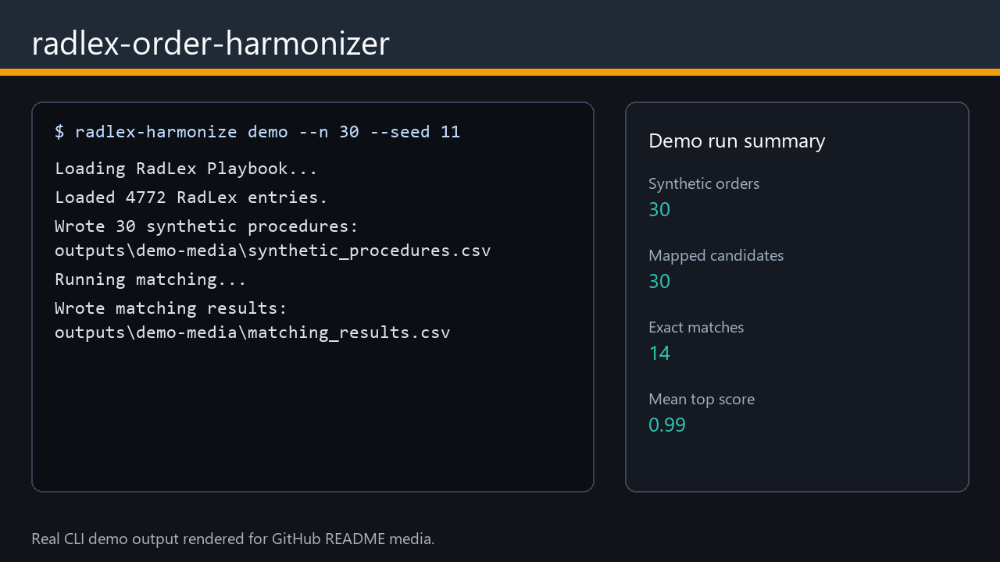

# radlex-order-harmonizer

[](https://github.com/AKaturu/radlex-order-harmonizer/actions/workflows/ci.yml)
[](https://github.com/AKaturu/radlex-order-harmonizer/actions/workflows/release.yml)
[](https://www.python.org/)
[](LICENSE)

**Map local radiology procedure names to standardized RadLex Playbook identifiers.**



Hospitals often have local procedure names that drift from standard terminology. This makes analytics, protocol review, migration, and cross-site reporting harder. This project creates transparent RadLex Playbook candidate mappings that can be reviewed by radiology operations, informatics, and quality teams.

## Evidence Status

| Evidence | Status |
|---|---|
| Unit and integration tests | Complete |
| Synthetic end-to-end evaluation | Complete |
| Public-data evaluation | Not completed |
| Independent expert review | Not completed |
| Institutional validation | Not completed |
| Prospective clinical validation | Not completed |

This software is a research prototype and is not intended for independent clinical decision-making.

## Capabilities

- Downloads and caches the RadLex Playbook CSV from RSNA
- Normalizes local procedure names (expands abbreviations, detects modality/anatomy/contrast/laterality)
- Three-tier matching: exact, token-overlap, and fuzzy (rapidfuzz)
- Exports top candidates with confidence scores and matching strategy
- Streamlit dashboard for interactive mapping review
- Human adjudication import (accept/reject candidate mappings)

## Quick Start

```bash
pip install -e ".[app]"
radlex-harmonize demo --output outputs/demo --n 50 --seed 42
radlex-harmonize serve
```

## Data Source

RadLex Playbook is provided by the [Radiological Society of North America (RSNA)](https://www.rsna.org/practice-tools/data-tools-and-standards/radlex-radiology-lexicon). This tool downloads the complete Playbook CSV from `https://api3.rsna.org/radlex/v1/createCsv?csvType=new`. Review the [RadLex License](http://www.rsna.org/uploadedFiles/RSNA/Content/Informatics/RadLex_License_Agreement_and_Terms_of_Use_V2_Final.pdf) before redistributing derived data.

## Limitations

- This tool is intended for terminology review, research, and quality improvement workflows
- It does not replace human adjudication
- Should not automatically overwrite production order dictionaries without institutional review
- Validate matching against institution-specific order dictionaries before operational use

## Releases

Download the current Windows, macOS, or Linux archive from the [Releases page](https://github.com/AKaturu/radlex-order-harmonizer/releases). SHA-256 checksum sidecars are attached to the release assets.

## Documentation

| Topic | File |
|---|---|
| Release steps | [docs/release.md](docs/release.md) |
| Demo media generation | [docs/demo-media.md](docs/demo-media.md) |
| Input CSV format and output fields | [README.md](README.md) (Input CSV Format section) |
| Contribution guide | [CONTRIBUTING.md](CONTRIBUTING.md) |
| Security reporting | [SECURITY.md](SECURITY.md) |

## License

MIT. See [LICENSE](LICENSE).
